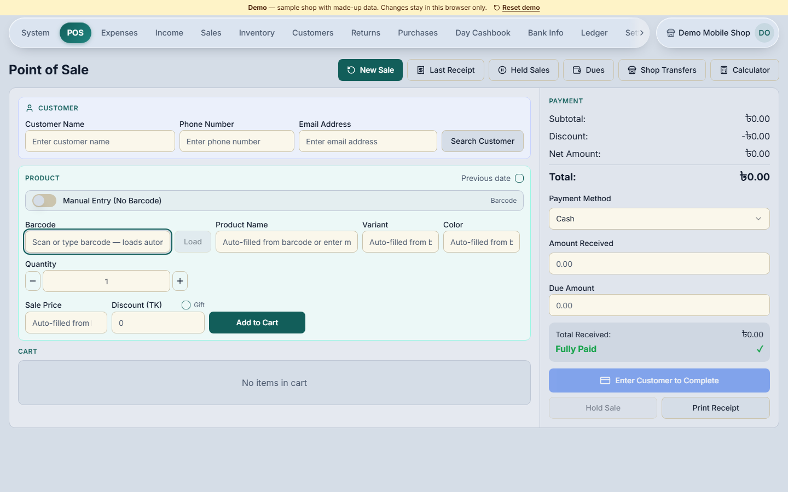
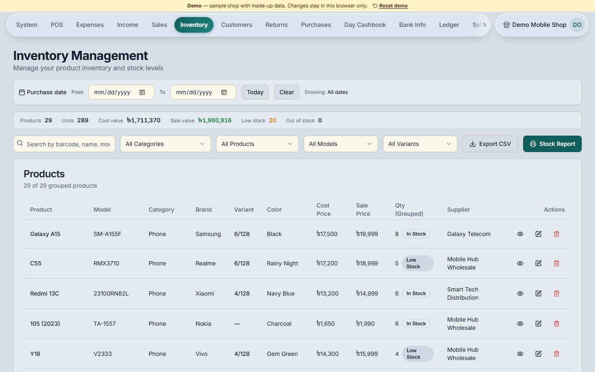
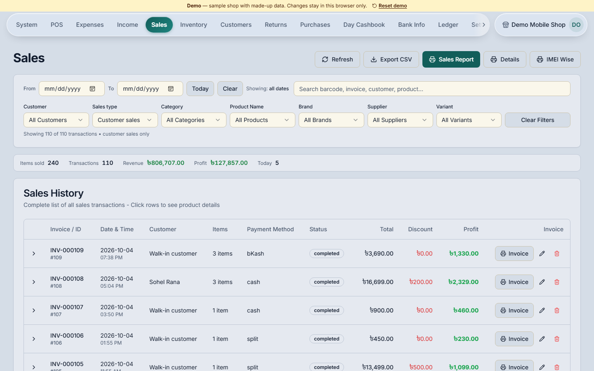
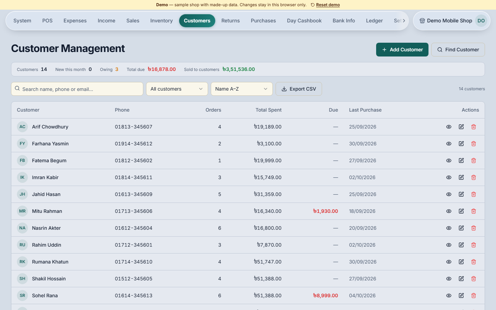
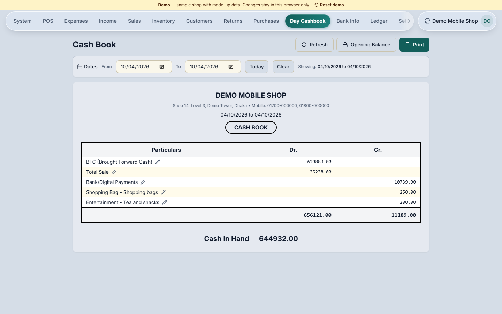

# Mobile POS (Demo)

Point of sale, stock and accounts for mobile phone and accessories shops.

This repository is the **demo build**. It runs entirely in the browser on a
sample shop with made-up data. There is no server and no account to create,
and nothing you do here leaves your browser.

**Live demo:** (https://mobile-pos-demo.mobile-pos-demo.workers.dev/pos)



---

## Who it's for

A typical phone shop sells handsets one IMEI at a time, sells chargers and
covers by the dozen with no barcode at all, gives regular customers credit,
and pays suppliers in parts. Most of the day's money comes in as cash, bKash,
Nagad and card, often several at once on a single sale.

Mobile POS is built around exactly that. It started with one shop's daily
routine and grew to cover the books behind it.

## What it does

**Selling**
- Scan a barcode or IMEI, or pick counted stock by name
- Split one sale across cash, bKash, Nagad, Rocket, Upay, card and bank transfer
- Sell on credit; dues are tracked per invoice and collected later
- Hold a sale and come back to it, or record a sale on an earlier date
- Printed receipts with the shop's details and a Bangla or English footer

**Stock**
- Products with brand, model, variant (e.g. 8/256) and colour
- One unit per IMEI for handsets, counted quantities for accessories
- Purchase vouchers per delivery, with what was paid and what is still owed
- Sales returns, exchanges, and returns to the supplier
- Low-stock and out-of-stock at a glance, with CSV export

**Money**
- Day cash book with brought-forward cash and opening balance
- Expenses by head, owner investment and supplier income
- Supplier dues, advances and promo claims
- Ledger with purchase ledger, expense and income vouchers, profit and loss,
  and balance sheet
- Bank and mobile banking report

**Running the shop**
- Owner and manager accounts, with managers limited to recent days
- More than one shop under one owner, with stock transfers between them
- Windows desktop app that updates itself

## Screenshots

| | |
|---|---|
|  |  |
| Inventory | Sales history |
|  |  |
| Customers and dues | Day cash book |

## About this demo

The demo uses the same screens as the real system. Only the data layer is
different: it reads from and writes to a small database kept in the browser,
filled with about three weeks of activity in a fictional shop.

- Sign in with the details already on the login screen.
- Everything you change is saved in your browser only. Other visitors never see it.
- **Reset demo** in the top bar puts the sample shop back. It also starts
  fresh each day, so "today" always has today's figures.
- The shop opens at 10 am. Before that, today's screens are empty.

A few things are switched off in the demo and say so when you try them:
exchanges, returns to a supplier, editing a finished sale, transfers between
shops, adding a shop and managing staff accounts.

## Running it locally

You need Node.js 20 or newer.

```bash
npm install
npm run dev
```

Then open <http://localhost:3000>.

## Deploying

The demo is set up for Cloudflare Workers through OpenNext. It deploys as its
own Worker, `mobile-pos-demo`, so it can't touch the production app.

```bash
npm run cf:deploy
```

No environment variables or secrets are needed.

## How the demo works

All of the demo-specific code is in [`demo/`](demo):

| File | What it does |
|---|---|
| `client.ts` | Stands in for the Supabase client the app normally uses |
| `query.ts` | Handles the app's queries: filters, sorting, paging and linked tables |
| `rpc.ts` | The database functions (sales, payments, deliveries, lookups) rewritten for the browser |
| `seed.ts` | Builds the sample shop |
| `db.ts` | Keeps the data in memory and saves it to localStorage |

The four files in `utils/supabase/` hand every screen the demo client in place
of a real connection. That swap is the only change to the application code,
apart from the demo banner and the pre-filled login form.

## Built with

Next.js, React and TypeScript, styled with Tailwind CSS and Radix UI. The
full product runs on Supabase (Postgres with row-level security) and ships as
a Windows app through Electron.

## Want it for your shop?

The full version runs on a real database with backups, staff accounts and the
desktop app. Get in touch for a walkthrough or pricing.

**Apurba Roy**
mail: apurbor39@gmail.com


## Licence

Copyright © 2026 Apurba Roy. All rights reserved.

This code is shared so the product can be seen and tried. It may not be
copied, modified or used in another product without written permission.
